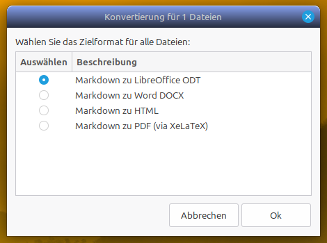
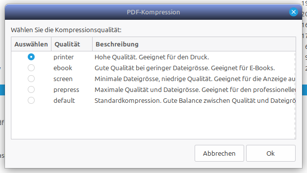

# Nemo Actions: Universal Converter & PDF Compressor

A set of productivity scripts for the Nemo File Manager (standard in Linux Mint/Cinnamon) that allows you to convert documents and images or compress PDF files directly from your right-click context menu.

## Features

### 1. Universal File Converter (`tci_converter.sh`)
This script provides a graphical interface to convert files between various formats.
- **Markdown Support:** Convert `.md` or `.markdown` to ODT, DOCX, HTML, or PDF.
- **Office Documents:** Convert ODT to Markdown or HTML to Markdown.
- **Data:** Convert CSV files into formatted ODT tables.
- **Images:** Convert between PNG, JPG, and WebP formats.
- **Batch Processing:** Select multiple files of the same type to convert them all at once.
- **Smart Checks:** The script automatically detects missing dependencies and warns you if you select mixed file types.



### 2. PDF Compressor (`compress_pdf.sh`)
Quickly reduce the file size of PDF documents using Ghostscript.
- **Quality Profiles:**
    - **Printer:** High quality (300 dpi), suitable for printing.
    - **Ebook:** Medium quality (150 dpi), ideal for digital reading.
    - **Screen:** Low quality (72 dpi), optimized for web and email.
    - **Prepress:** Maximum quality and size.
    - **Default:** A balanced standard compression.
- **Non-destructive:** Creates a new file with the `_compressed` suffix, leaving your original file untouched.



## Requirements

To use all features, ensure the following packages are installed on your system:

```bash
sudo apt update
sudo apt install zenity pandoc ghostscript imagemagick libreoffice texlive-xetex texlive-fonts-recommended
```

| Tool | Purpose |
| :--- | :--- |
| **Zenity** | Provides the graphical dialogs and progress bars. |
| **Pandoc** | Handles document conversions (Markdown, ODT, DOCX, etc.). |
| **Ghostscript** | Powering the PDF compression. |
| **ImageMagick** | Handles image format conversions. |
| **XeLaTeX** | Required if you want to convert Markdown directly to PDF. |
| **LibreOffice** | Recommended for high-quality ODT/DOCX processing. |

## Installation

### 1. Prepare the Scripts
Copy the `.sh` scripts to a permanent location (e.g., `~/scripts/` or `~/.local/bin/`) and make them executable:

```bash
chmod +x /path/to/scripts/tci_converter.sh
chmod +x /path/to/scripts/compress_pdf.sh
```

### 2. Create Nemo Action Files
Nemo looks for `.nemo_action` files in `~/.local/share/nemo/actions/`. Create two files there:

#### `universal_converter.nemo_action`
```ini
[Nemo Action]
Name=Convert File...
Comment=Convert documents and images
Exec=/path/to/your/script/tci_converter.sh %F
Icon-Name=document-export
Selection=any
Extensions=md;markdown;odt;docx;csv;html;htm;png;jpg;jpeg;webp;
Separator=;
```

#### `compress_pdf.nemo_action`
```ini
[Nemo Action]
Name=Compress PDF...
Comment=Reduce PDF file size
Exec=/path/to/your/script/compress_pdf.sh %F
Icon-Name=file-pdf
Selection=any
Extensions=pdf;
Separator=;
```

*Note: Replace `/path/to/your/script/` with the actual absolute path where you stored the `.sh` files.*

### 3. Refresh Nemo
Restart Nemo to load the new actions:
```bash
nemo -q
```

## Usage
1. Open Nemo and navigate to your files.
2. Select one or more files of the same type.
3. Right-click and choose **"Convert File..."** or **"Compress PDF..."**.
4. Follow the on-screen prompts to choose your target format or quality level.